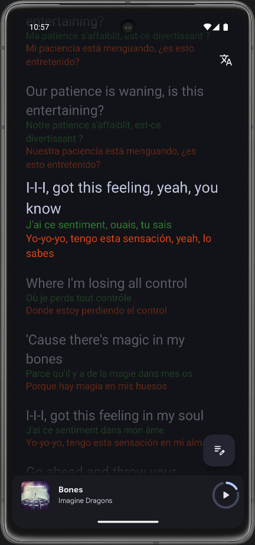
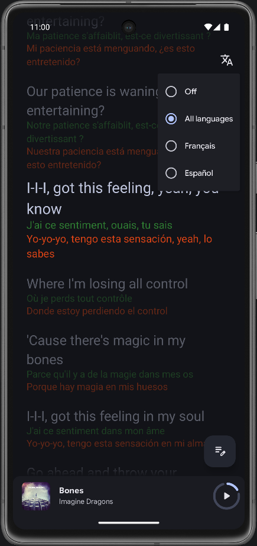
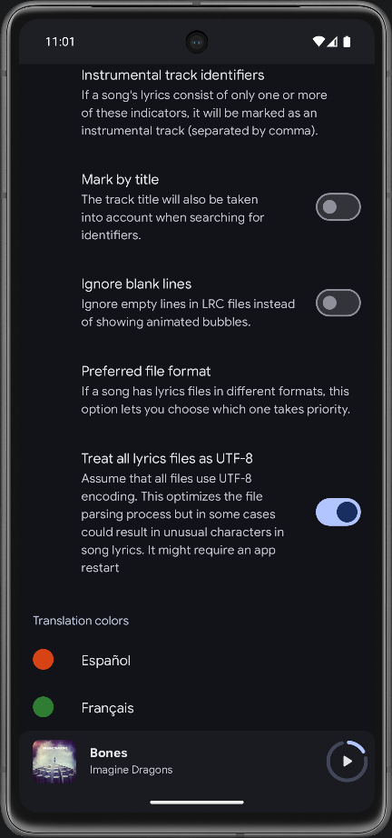
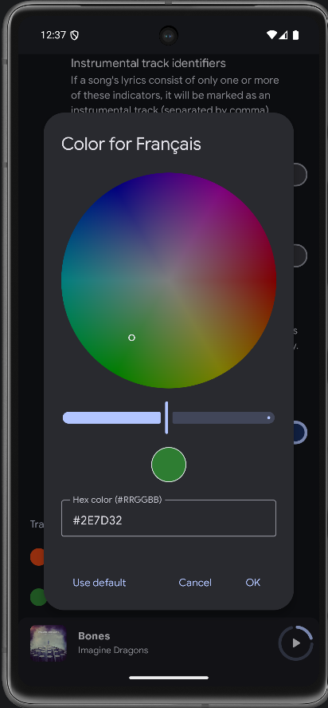
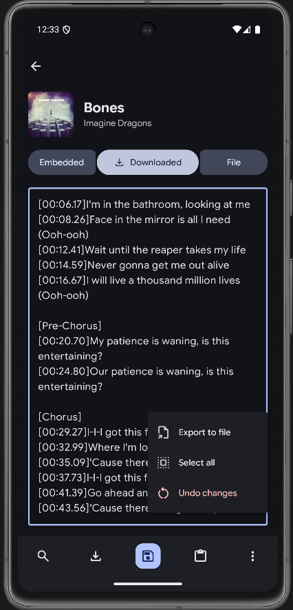
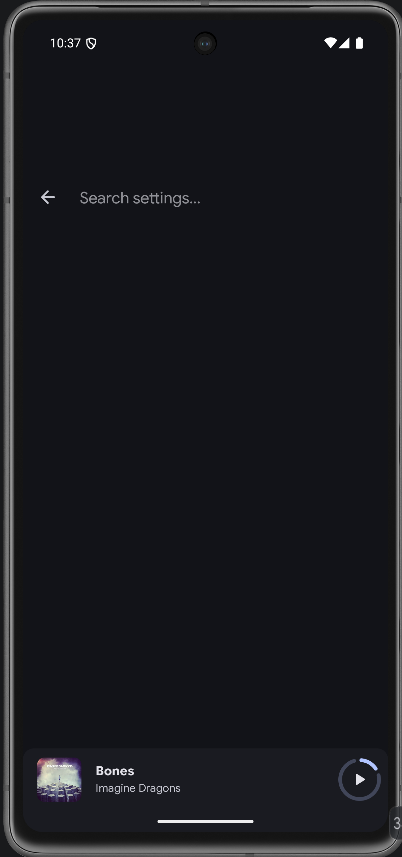

<div align="center">


# 🎵 Booming Music — International edition

### Modern design. Pure sound. Fully yours.

> 🌍 **This is a community fork of [Booming Music](https://github.com/mardous/BoomingMusic) by
> [Christians Martínez Alvarado (mardous)](https://github.com/mardous).** It adds **multilingual
> lyrics** features on top of the original app. All credit for Booming Music goes to the upstream
> project; this fork only layers the extras described in
> [🌐 Multilingual lyrics (this fork)](#-multilingual-lyrics-this-fork) and stays **GPLv3**.
> Upstream issues: [#474](https://github.com/mardous/BoomingMusic/issues/474),
> [#475](https://github.com/mardous/BoomingMusic/issues/475).

</div>

> 💌 **To the original developers, authors and contributors of Booming Music:** thank you for the
> app this fork is built on. You are warmly welcome to take this fork as a whole, or cherry-pick any
> part of the multilingual-lyrics work described below, back into upstream or into anything else —
> no permission needed and no strings attached. It is all offered under the same **GPLv3** license,
> and we'd be delighted to see it land upstream.

## 🌐 Multilingual lyrics (this fork)

This fork extends the lyrics view so a single song can show **several translations at once** and lets
you control how they appear. Everything below is additive — files with zero or one translation look
exactly like they do upstream.

- **🈁 Multiple stacked translations** — when a lyric file contains more than one translation, all of
  them are shown stacked under the original line (previously only the first was kept). Works with
  **ELRC** (extra lines sharing the same timestamp) and **TTML** (multiple
  `<span ttm:role="x-translation">` per line). The word-by-word highlight stays on the original.
- **🗣️ In-app language selector** — a globe button in the lyrics screen opens a menu listing the
  languages found in the current file, plus **Off** and **All languages**. The choice is remembered
  and applies everywhere (full screen and the now-playing cover).
- **🎨 Per-language colors** — in **Settings → Lyrics → Translation colors**, give each detected
  language a fixed color so stacked translations are easy to tell apart at a glance. Each language
  opens a full **HSV color wheel** with a brightness slider and a `#RRGGBB` hex field, plus a **Use
  default** option to clear it.
- **🏷️ LRC language tags** — LRC/ELRC translation lines can declare their language with a bracket
  block right after the timestamp, e.g. `[00:12.00][fr]…` or `[00:12.00][pt-BR]…`. Untagged lines
  keep working as before.
- **💾 Save lyrics to a local file** — from the lyrics editor you can **Export to file**, writing the
  current lyrics to a standalone file outside the app (alongside the **Embedded / Downloaded / File**
  sources), so edited or translated lyrics can be kept and shared as their own sidecar.

### 📸 Screenshots

<div align="center">
<table>
<tr>
<td align="center" width="33%"><br/>Stacked translations</td>
<td align="center" width="33%"><br/>Language selector</td>
<td align="center" width="33%"><br/>Per-language colors</td>
</tr>
<tr>
<td align="center" width="33%"><br/>HSV color picker</td>
<td align="center" width="33%"><br/>Save lyrics to a file</td>
<td align="center" width="33%"><br/>Settings search</td>
</tr>
</table>
</div>

> _More screenshots live in [`assets/intl/`](assets/intl/)._

### 🧪 Try it without your own files

Sample sidecar files live in [`samples/multilingual-lyrics/`](samples/multilingual-lyrics/). To test
on any track:

1. Pick a song already on your device/emulator (any audio file).
2. Copy a sample next to it, renamed to the **same base name** so Booming picks it up as a sidecar:
   - `YourSong.lrc` ← e.g. [`elrc_multi_translation.lrc`](samples/multilingual-lyrics/elrc_multi_translation.lrc)
     or the Bones example `Bones - Imagine Dragons.lrc`
   - `YourSong.ttml` ← e.g. `Bones - Imagine Dragons.ttml`
3. Open the song, show the lyrics and play. You should see the original on top with each translation
   stacked below; use the globe to switch languages and **Settings → Lyrics → Translation colors** to
   color them.

> Test only one sidecar (`.lrc` **or** `.ttml`) per song — TTML is preferred when both are present.
> The Imagine Dragons "Bones" sample ships only the `.lrc`/`.ttml` lyric files (no audio); bring your
> own copy of the track to play along. See
> [`samples/multilingual-lyrics/README.md`](samples/multilingual-lyrics/README.md) for details.

### 🛠️ Build it yourself

```sh
# Debug APK (installable, no signing key required)
./gradlew :app:assembleNormalDebug
# Output: app/build/outputs/apk/normal/debug/

# Run the off-device lyrics-parser unit tests
./gradlew :app:testNormalDebugUnitTest --tests "com.mardous.booming.data.local.lyrics.*"
```


<div align="center">

<a href="https://ko-fi.com/christiaam" target="_blank">

</a>

### ❤️ Supporters

<table>
  <tr>
    <td>
      <b>mbeezy</b><br/>
      <b><a href="https://github.com/Qoojoe">KKTweex</a></b><br/>
      <b><a href="https://github.com/FabiRich">FabiRich</a></b><br/>
      <b><a href="https://github.com/Bloodaxe95">Bloodaxe</a></b>
    </td>
    <td>
      <b>Bernhard</b><br/>
      <b>Andreas Hirth</b><br/>
      <b>Revolver327</b><br/>
      <b>Peter Smith</b>
    </td>
  </tr>
</table>

</div>

## 🙌 Credits

Inspired by [Retro Music Player](https://github.com/RetroMusicPlayer/RetroMusicPlayer).
Also thanks to:

- [AMLV](https://github.com/dokar3/amlv)
- [LRCLib](https://lrclib.net/)
- [Better Lyrics](https://better-lyrics.boidu.dev/)
- [Lyrically API](https://lyrics.paxsenix.org/) (by [Alex](https://github.com/Paxsenix0))

## ⚖️ License

```
GNU General Public License - Version 3

Copyright (C) 2025 Christians Martínez Alvarado

This program is free software: you can redistribute it and/or modify
it under the terms of the GNU General Public License as published by
the Free Software Foundation, either version 3 of the License, or
(at your option) any later version.

This program is distributed in the hope that it will be useful,
but WITHOUT ANY WARRANTY; without even the implied warranty of
MERCHANTABILITY or FITNESS FOR A PARTICULAR PURPOSE.  See the
GNU General Public License for more details.

You should have received a copy of the GNU General Public License
along with this program.  If not, see <http://www.gnu.org/licenses/>.
```

---

<p align="center"><a href="#readme">⬆️ Back to top</a></p>
